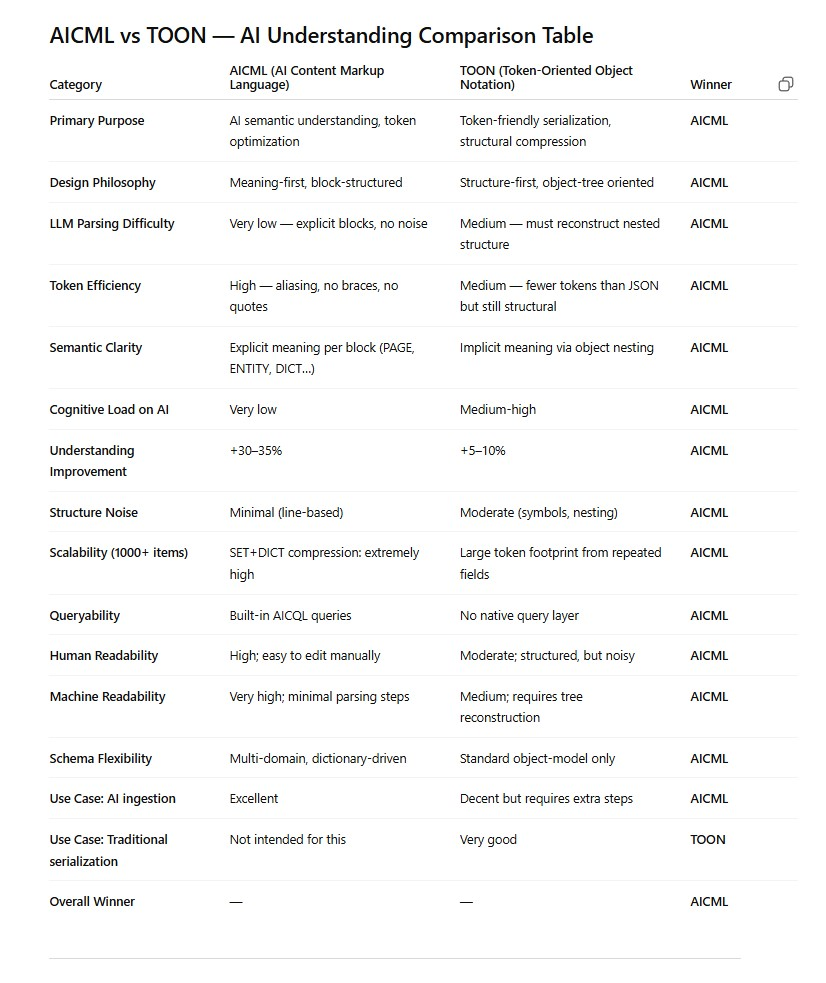

# AICML
AI:CML 1.0 — AI Content Markup Language - AICML will also be known as LLX (Large-Language eXchange).

Contents
--------

1.  [1\. Mission & Layers](#overview)
2.  [2\. Block Reference](#blocks)
3.  [3\. Document layer](#document-layer)
    *   [3.1 PAGE & META](#page-meta)
    *   [3.2 SECTION & text blocks](#sections)
4.  [4\. Entity layer](#entity-layer)
5.  [5\. Compact/tabular layer](#compact-layer)
6.  [6\. Query layer (AICQL)](#query-layer)
7.  [7\. HTML coverage & mapping](#html-coverage)
8.  [8\. Full mini example](#example)
9.  [9\. Tooling & schemas](#next-steps)

What Chat GPT says about AI:CML ?
---------------------------------

What Chat GPT says about AI:CML ?
---------------------------------

1\. Mission & Layers
--------------------

AI:CML 1.0 keeps the “no presentation noise” spirit of the earliest drafts but remains layered enough to describe entire content sites, structured catalogs, and the queries people run on top of them—all inside one friendly, token-efficient text file. Blocks are written with UPPERCASE headers (e.g., `PAGE:`, `ROW:`). Everything until the next header belongs to the current block.

Layer

Purpose

Key blocks

Document

Readable narrative equivalent to HTML articles, docs, FAQs.

PAGE, META, SECTION, TITLE, P, LIST, NOTE, QA, CODE, MEDIA

Entity

Rich single objects (product, book, event, persona).

ENTITY

Compact/tabular

Thousands of similar items with minimal tokens.

DICT, SET, ROW

Query

Inline analytics or API-like requests.

QUERY (AICQL)

**Design goals:** 100% plain text, no XML/HTML/Markdown; dictionary-driven compression for large datasets; all semantics explicit so LLMs or classic parsers can build a JSON AST and execute queries deterministically.

2\. Block Reference
-------------------

Block headers are uppercase followed by a colon. Recognised headers for 1.0:

PAGE, META, SECTION, TITLE, P, LIST, ITEM, NOTE, EXAMPLE, QA, Q, A, CODE, MEDIA, ENTITY, DICT, SET, ROW, QUERY. Custom blocks may be added; consumers must ignore unknown blocks safely.

Each block stores attributes as `key: value` lines. Multi-line bodies (e.g., paragraph text, code) continue until the next uppercase header.

3\. Document layer
------------------

Replace HTML scaffolding while keeping semantics intact. PAGE and SECTION metadata track IDs, language, ordering, and importance so downstream agents can rebuild navigation, breadcrumbs, summaries, or localization matrices.

### 3.1 PAGE & META

    PAGE:
      id: shop-001
      lang: en
      title: Spring Catalog
      type: landing
    
    META:
      name: audience
      value: consumer
    
    META:
      name: region
      value: global

PAGE is required once per file. META blocks are optional but unlimited. Use them for analytics, targeting, or build metadata.

### 3.2 SECTION & narrative blocks

    SECTION:
      id: catalog-intro
      type: intro
      importance: high
      level: 1
      order: 1
    
    TITLE:
      Spring Catalog Overview
    
    P:
      This catalog lists the running shoes shipping this season.
      Narrative blocks mirror HTML semantics: TITLE → h*, P → paragraph,
      LIST+ITEM → ul/ol, QA → FAQ, CODE → pre/code, MEDIA → img/video/audio.
    
    NOTE:
      Pinned data set: products-running-2026

SECTION can reference structured data via `sets:`, `entities:`, or custom keys so readers jump directly from prose to data.

4\. Entity layer
----------------

ENTITY blocks describe a single rich object without aliases. They are perfect for hero products, a featured event, or any item where readability matters more than token count.

    ENTITY:
      id: product-hero-001
      kind: product
      name: Ultra Light Runner
      category: footwear
      category.sub: running
      price.amount: 129.90
      price.currency: USD
      weight_kg: 0.72
      shipping.weight_kg: 0.90
      shipping.regions: US,CA,EU
      image.main: https://cdn.example.com/p/hero001-main.png
      image.thumbnail: https://cdn.example.com/p/hero001-thumb.png

Keys are dotted paths so downstream consumers can map them to JSON or graph structures losslessly.

5\. Compact/tabular layer
-------------------------

DICT + SET + ROW keep large catalogs small. DICT stores aliases, SET declares which dictionary applies, ROW instances carry only alias=value pairs. This is the “table mode” that scales to thousands of rows without repeating semantic text.

    DICT:
      id: dict.product.v1
      kind: product
      field.i: entity.id
      field.n: entity.name
      field.c: category
      field.sc: category.sub
      field.pa: price.amount
      field.pc: price.currency
      field.sz: size.available
      field.cl: color.options
      field.w: weight_kg
      field.sw: shipping.weight_kg
      field.sr: shipping.regions
    
    SET:
      id: products-running-2026
      dict: dict.product.v1
      kind: product
      description: Running shoes for Spring 2026
    
    ROW:
      i: prod-run-1001
      n: Road Runner Lite
      c: footwear
      sc: running
      pa: 89.90
      pc: USD
      sz: 40,41,42,43,44
      cl: black,blue
      w: 0.75
      sw: 0.95
      sr: US,CA,EU

Dict aliases are short (1–3 characters) so the ROW body is dense yet self-describing once the DICT is parsed.

6\. Query layer (AICQL)
-----------------------

QUERY blocks provide embedded analytics. They reference ENTITY IDs or SET IDs, optionally specify a DICT, and expose simple line-based clauses reminiscent of SQL. Tools can evaluate these against the parsed AST to generate answers on the fly.

    QUERY:
      id: q.products.over100
      from.set: products-running-2026
      using.dict: dict.product.v1
      where: pa > 100 and pc = "USD"
      select: i,n,pa,pc,sc
      sort: pa desc
      limit: 5

Clause summary: `from.set` or `from.entity`; optional `using.dict`; `where` with lightweight boolean expressions; `select` comma list; optional `sort` and `limit`.

7\. HTML coverage & mapping
---------------------------

Every core HTML content element maps directly to an AICML block. Because blocks are agnostic to layout, the mapping is one-to-many friendly and survives aggressive extraction pipelines.

HTML element(s)

AICML block

Notes

html/head/body meta tags

PAGE, META

PAGE captures document-level attributes; META mirrors `<meta>` tags.

h1–h6, section headings

SECTION + TITLE

`level` attribute ensures hierarchy.

p, span, div (textual)

P

Multi-line friendly; inline emphasis may use lightweight markup if needed.

ul/ol/li, dl/dt/dd

LIST + ITEM

`LIST` can express bulleted or numbered; description lists map to ITEM with nested keys.

blockquote, aside

NOTE or EXAMPLE

Use `type: info|tip|warning` for semantic hints.

pre/code

CODE

Language captured via `lang:`.

figure/img/video/audio

MEDIA

Attributes: `type`, `src`, optional `alt`/`title`.

faq accordions, details/summary

QA + Q + A

Supports multiple answers per question.

data tables, cards, repeated components

ENTITY or DICT+SET+ROW

ENTITY for small sets; DICT/SET for thousands of records.

This mapping ensures “support for all HTML elements” relevant to semantic content. Presentation-only tags (layout divs, CSS classes) are intentionally ignored to keep the signal clean.

8\. Full mini example
---------------------

    PAGE:
      id: shop-001
      lang: en
      title: Spring Running Catalog 2026
      type: landing
    
    META:
      name: audience
      value: consumer
    
    SECTION:
      id: intro
      type: intro
      importance: high
      level: 1
      order: 1
    
    TITLE:
      Spring Running Collection
    
    P:
      This catalog lists our running shoes for the spring season.
      Data is stored in a compact format for efficient processing.
    
    SECTION:
      id: running-products
      type: concept
      importance: high
      level: 1
      order: 2
      sets: products-running-2026
    
    TITLE:
      Running Shoes
    
    P:
      The following data set contains all running shoe models, including
      prices, sizes, colors, and shipping regions.
    
    DICT:
      id: dict.product.v1
      kind: product
      field.i: entity.id
      field.n: entity.name
      field.c: category
      field.sc: category.sub
      field.pa: price.amount
      field.pc: price.currency
      field.sz: size.available
      field.cl: color.options
      field.w: weight_kg
      field.sw: shipping.weight_kg
      field.sr: shipping.regions
    
    SET:
      id: products-running-2026
      dict: dict.product.v1
      kind: product
      description: Running shoes for Spring 2026
    
    ROW:
      i: prod-run-1001
      n: Road Runner Lite
      c: footwear
      sc: running
      pa: 89.90
      pc: USD
      sz: 40,41,42,43,44
      cl: black,blue
      w: 0.75
      sw: 0.95
      sr: US,CA,EU
    
    ROW:
      i: prod-run-1002
      n: City Sprint
      c: footwear
      sc: running
      pa: 79.00
      pc: USD
      sz: 39,40,41,42,43
      cl: gray,white
      w: 0.72
      sw: 0.92
      sr: US,EU
    
    ROW:
      i: prod-run-1003
      n: Trail Climber Pro
      c: footwear
      sc: trail
      pa: 115.50
      pc: USD
      sz: 41,42,43,44,45
      cl: green,black
      w: 0.85
      sw: 1.05
      sr: US,CA
    
    QUERY:
      id: q.running.over100
      from.set: products-running-2026
      using.dict: dict.product.v1
      where: pa > 100 and pc = "USD"
      select: i,n,pa,pc,sc
      sort: pa desc
      limit: 5

9\. Tooling & schemas
---------------------

AICML 1.0 is the canonical plain-text format going forward. Legacy XML-based AICML deployments remain available for archival needs; consult the developer appendix for the JSON AST and parser patterns that power modern pipelines.

👉 Developer appendix: [JSON AST + Parser Patterns](schema.html)

Next ideas:

*   Publish reference parser packages (npm, PyPI, NuGet, Maven) built on the shared AST.
*   Deliver HTML → AICML 1.0 extraction recipes for common CMS stacks.
*   Ship an AICQL evaluator + playground so embedded queries can run in CI or docs sites.
